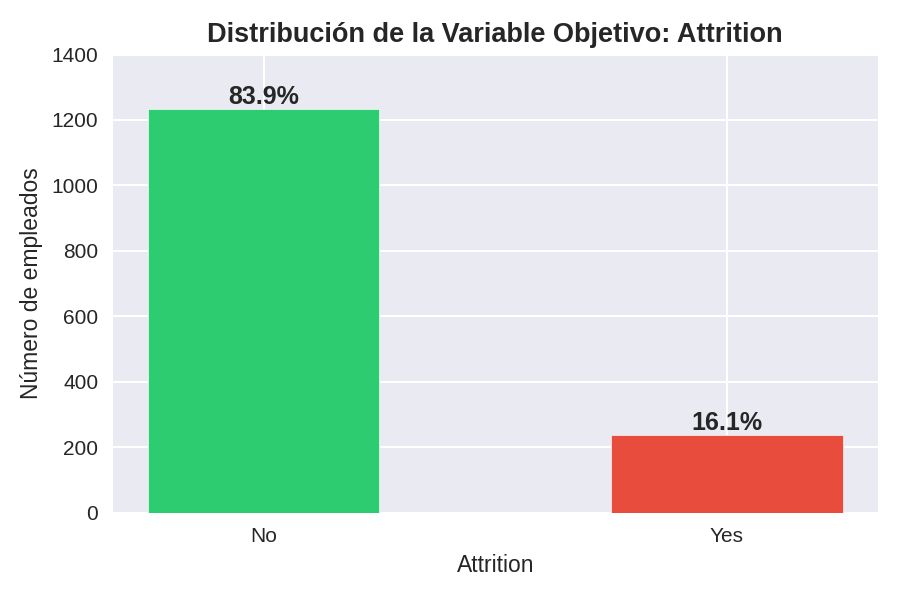
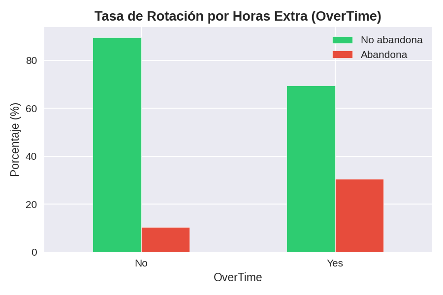
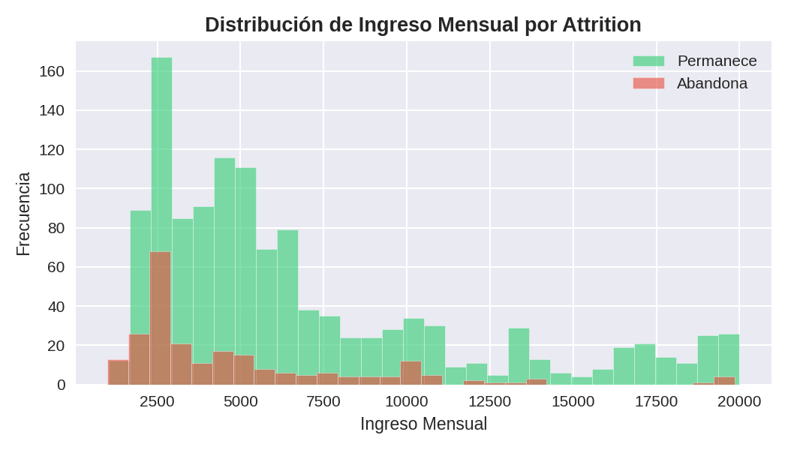
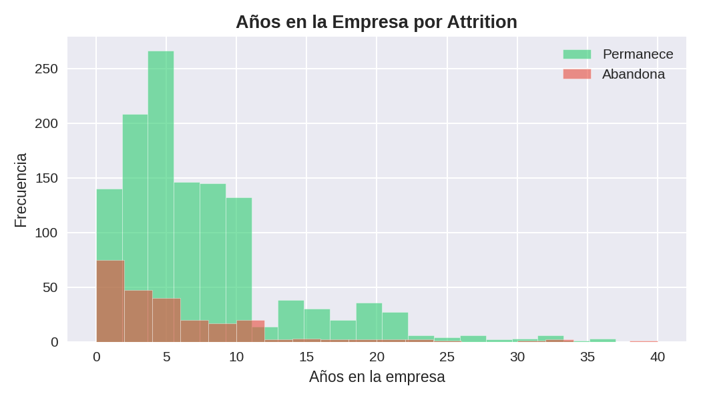
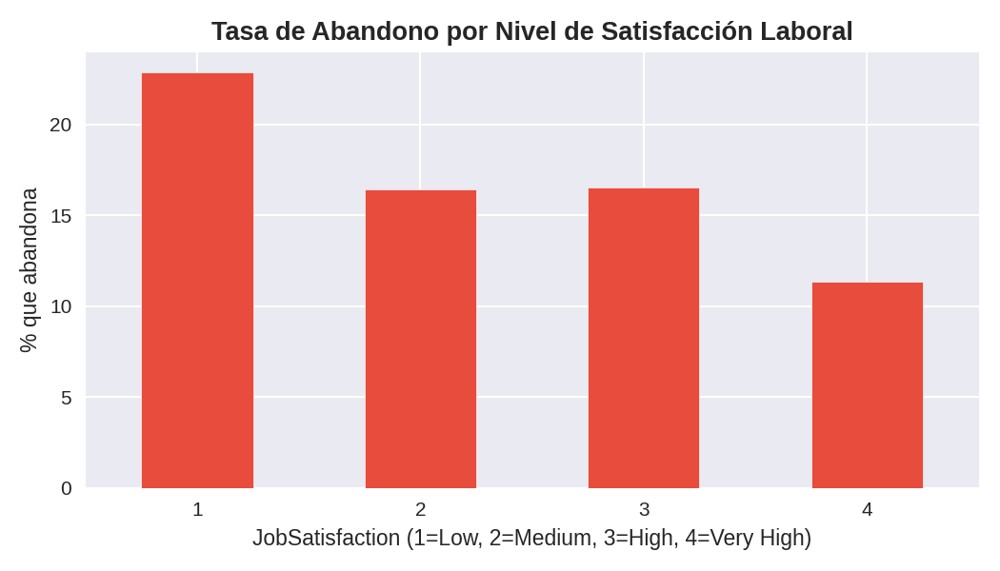
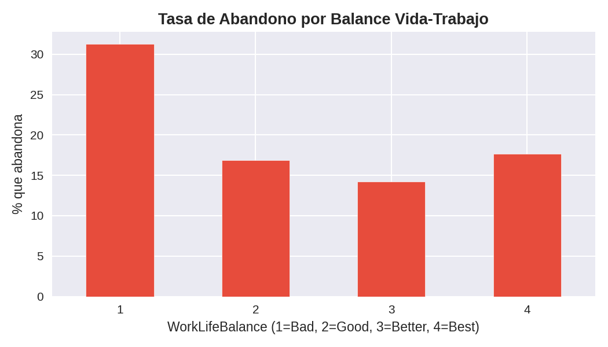
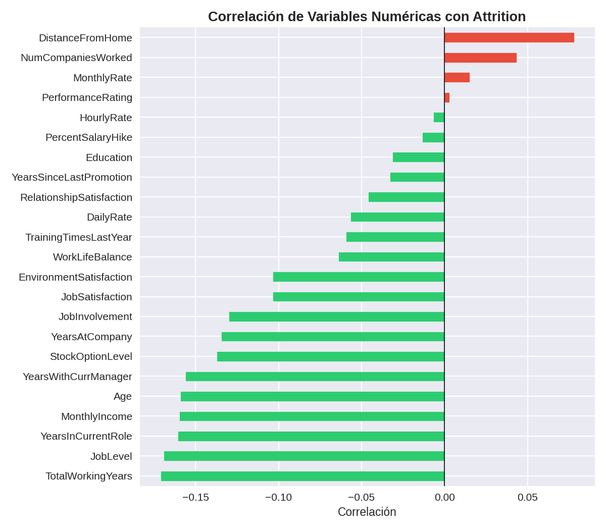

# Análisis Cualitativo del Dataset

## TalentGuard: Sistema Inteligente para la Predicción del Riesgo de Rotación de Empleados

**Autor:** Nicolas Gomez  
**Programa:** Tecnología en BDesarrollo de Software  
**Asignatura: Diplomado Opción de grado Programación Web**
**Fecha:** Junio 2026

---

## 1. Descripción General

El _IBM HR Analytics Employee Attrition & Performance Dataset_ es un conjunto de datos sintético creado por científicos de datos de IBM, diseñado para explorar los factores que influyen en la rotación voluntaria de empleados dentro de una organización. Aunque los datos son ficticios, replican patrones realistas del comportamiento organizacional y son ampliamente utilizados en proyectos de analítica de recursos humanos a nivel académico y profesional.

El dataset está disponible públicamente en Kaggle bajo licencia **CC0 (dominio público)**, lo que permite su uso académico y comercial sin restricciones. Fue construido con el propósito explícito de responder preguntas sobre rotación laboral, lo que lo hace directamente pertinente para los objetivos de este proyecto.

---

## 2. Estructura del Dataset

El dataset contiene **1.470 registros**, donde cada fila representa un empleado, y **35 variables** que describen sus características demográficas, laborales, salariales y de satisfacción organizacional.

| Tipo de variable  | Cantidad | Ejemplos                                                    |
| ----------------- | -------- | ----------------------------------------------------------- |
| Numéricas (int64) | 26       | `Age`, `MonthlyIncome`, `YearsAtCompany`, `JobSatisfaction` |
| Categóricas (str) | 9        | `Attrition`, `Department`, `JobRole`, `OverTime`, `Gender`  |

Las variables de satisfacción (`JobSatisfaction`, `EnvironmentSatisfaction`, `WorkLifeBalance`, `RelationshipSatisfaction`) están codificadas numéricamente en escala del 1 al 4, lo cual facilita su uso directo en modelos de clasificación sin necesidad de transformaciones adicionales.

---

## 3. Variables Relevantes

Las variables de entrada se agrupan en cuatro categorías analíticas:

| Categoría                       | Variables                                                                                   |
| ------------------------------- | ------------------------------------------------------------------------------------------- |
| **Satisfacción organizacional** | `JobSatisfaction`, `EnvironmentSatisfaction`, `RelationshipSatisfaction`, `WorkLifeBalance` |
| **Carga laboral**               | `OverTime`, `BusinessTravel`, `JobInvolvement`                                              |
| **Compensación**                | `MonthlyIncome`, `PercentSalaryHike`, `StockOptionLevel`, `DailyRate`                       |
| **Antigüedad y trayectoria**    | `YearsAtCompany`, `YearsInCurrentRole`, `YearsSinceLastPromotion`, `TotalWorkingYears`      |

**Variable objetivo (y):** `Attrition` — indica si el empleado abandonó la organización (`Yes`) o permaneció en ella (`No`).

---

## 4. Calidad de los Datos

### 4.1 Preparación prevista para el modelado

Antes del entrenamiento del modelo de clasificación será necesario realizar algunas transformaciones sobre el dataset. En primer lugar, se eliminarán las variables constantes (EmployeeCount, Over18 y StandardHours), ya que no aportan capacidad predictiva. Posteriormente, las variables categóricas como Department, JobRole, MaritalStatus, Gender y OverTime serán codificadas mediante técnicas apropiadas de transformación de variables. Finalmente, debido al desbalance identificado en la variable objetivo Attrition, se evaluará la aplicación de estrategias como ajuste de pesos de clase o técnicas de sobremuestreo para mejorar la capacidad del modelo de detectar empleados con riesgo de abandono.

El dataset presenta una calidad excepcional para el modelado:

| Aspecto              | Resultado                          |
| -------------------- | ---------------------------------- |
| Valores nulos        | 0 en todas las columnas            |
| Registros duplicados | 0                                  |
| Tipos de datos       | Consistentes en todas las columnas |

Sin embargo, se identificaron **3 columnas constantes** que no aportan información al modelo y deben eliminarse antes del entrenamiento:

- `EmployeeCount`: todos los registros tienen valor `1`
- `Over18`: todos los registros tienen valor `Y`
- `StandardHours`: todos los registros tienen valor `80`

Adicionalmente, las variables categóricas como `OverTime`, `Department`, `JobRole`, `Gender` y `MaritalStatus` requerirán codificación (Label Encoding o One-Hot Encoding) antes del modelado.

---

## 5. Análisis de la Variable Objetivo

La variable `Attrition` presenta un **desbalance significativo** entre sus clases:

| Clase          | Registros | Porcentaje |
| -------------- | --------- | ---------- |
| No (permanece) | 1.233     | 83.9%      |
| Yes (abandona) | 237       | 16.1%      |

Este desbalance implica que un modelo que siempre prediga "No" obtendría una precisión aparente del 83.9% sin aprender ningún patrón real. Por esta razón, el F1-Score fue seleccionado como métrica principal, y se deberán considerar técnicas de balanceo como SMOTE o ajuste de pesos en el modelo durante el entrenamiento.

---

## 6. Hallazgos del Análisis Exploratorio

La exploración visual y estadística del dataset reveló los siguientes patrones relevantes para la predicción de rotación:

### 6.1 Horas Extra (OverTime)

Los empleados que realizan horas extra presentan una tasa de abandono del **30.5%**, casi tres veces superior a la de los empleados que no las realizan (**10.4%**). Esto convierte a `OverTime` en una de las variables con mayor poder predictivo del dataset, y es coherente con el contexto de la empresa de construcción e ingeniería donde la carga laboral es un factor crítico de rotación.

### 6.2 Ingreso Mensual (MonthlyIncome)

Existe una diferencia clara en la compensación entre ambos grupos. La mediana salarial de los empleados que permanecen es de **$5.204**, mientras que la de los empleados que abandonan es de **$3.202**, una diferencia del 38.5%. La mayoría de los abandonos se concentran en los rangos salariales más bajos (entre $2.500 y $5.000), lo que sugiere que la compensación es un factor determinante en la decisión de renuncia.

### 6.3 Antigüedad (YearsAtCompany)

Los empleados con menor antigüedad son los más propensos a abandonar la organización. La mediana de años en la empresa para quienes abandonan es de **3 años**, frente a **6 años** para quienes permanecen. El mayor volumen de renuncias se concentra entre los primeros 2 años, lo que indica que el período de adaptación y fidelización temprana es crítico para la retención.

### 6.4 Satisfacción Laboral (JobSatisfaction)

Se observa una relación inversa entre satisfacción y abandono. Los empleados con nivel de satisfacción bajo (`Low`) presentan una tasa de abandono del **22.8%**, mientras que quienes reportan satisfacción muy alta (`Very High`) tienen una tasa del **11.3%**. Esto confirma que la satisfacción laboral es un predictor relevante de la rotación.

### 6.5 Balance Vida-Trabajo (WorkLifeBalance)

Los empleados con peor balance vida-trabajo (`Bad`, nivel 1) presentan la mayor tasa de abandono. La tasa disminuye progresivamente conforme mejora el balance, lo que refuerza la importancia de esta variable en el modelo predictivo.

### 6.6 Correlación con Attrition

Las variables que presentan una mayor asociación lineal con la variable objetivo (es decir, que aumentan la probabilidad de renuncia) son `DistanceFromHome`, `NumCompaniesWorked` y `MonthlyRate`. Las variables con mayor correlación negativa (que reducen la probabilidad de abandono) son `TotalWorkingYears`, `YearsAtCompany` y `JobLevel`, lo que confirma que la estabilidad y la trayectoria profesional dentro de la organización son factores protectores contra la rotación.

---

## 7. Pertinencia del Dataset

El dataset es directamente pertinente para responder la pregunta analítica formulada. Contiene explícitamente la variable objetivo `Attrition` y todas las variables de entrada identificadas: satisfacción laboral, horas extra, balance vida-trabajo, antigüedad e ingresos mensuales. Adicionalmente, incluye variables complementarias como `Department`, `JobRole` y `BusinessTravel` que pueden enriquecer el análisis y mejorar la capacidad predictiva del modelo.

La naturaleza sintética del dataset no limita su valor académico, ya que los patrones que contiene replican dinámicas organizacionales documentadas en la literatura de gestión del talento humano.

---

## 8. Limitaciones

| Tipo de limitación         | Descripción                                                                                                                                                         |
| -------------------------- | ------------------------------------------------------------------------------------------------------------------------------------------------------------------- |
| **Datos sintéticos**       | El dataset fue generado artificialmente por IBM. Los patrones pueden no reflejar con exactitud las dinámicas reales del sector construcción e ingeniería.           |
| **Sin contexto sectorial** | No incluye variables específicas del sector como tipo de proyecto, modalidad de contrato, condiciones de obra o rotación por proyecto.                              |
| **Desbalance de clases**   | Solo el 16.1% de los registros corresponde a empleados que abandonaron, lo que requiere técnicas de balanceo antes del modelado.                                    |
| **Sin dimensión temporal** | No contiene fechas de ingreso ni de salida, por lo que no es posible analizar tendencias de rotación a lo largo del tiempo.                                         |
| **Roles no aplicables**    | Roles como `Research Scientist` o `Laboratory Technician` no son típicos del sector construcción, lo que limita la generalización directa al contexto del proyecto. |
| **Licencia**               | CC0 (dominio público). Uso académico y comercial permitido sin restricciones.                                                                                       |

---

_Documento generado como parte del Componente 3 — Entrega 1 del Proyecto Integrador_  
_Diplomado en Desarrollo Web — Tecnología en Desarrollo de Software_
